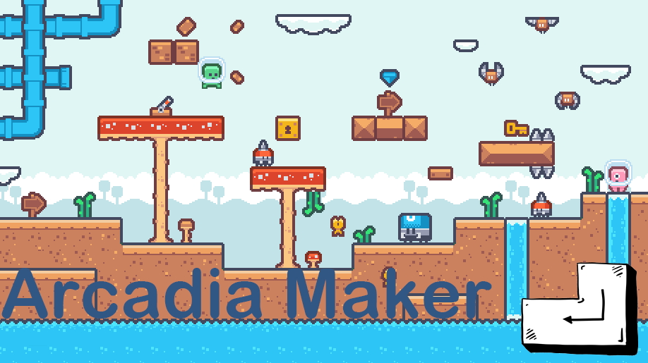

# Arcadia_Maker

2D Game Programing project (Arcadia_Maker)
 <small style="font-size:10px;">샌드박스형 플랫폼 게임</small>

프로젝트 기간 : 10월 12일 ~ 12월 5일
python의 pico2d 라이브러리를 사용한 2D 게임

Arcadia_Maker 1차 발표 링크 : https://youtu.be/ShTfKeEb9Mc?feature=shared

Arcadia_Maker 2차 발표 링크 : https://youtu.be/mRn8OS6AEI4?si=UhsSyHfUgRWz0_vY

Arcadia_Maker 3차 발표 링크 : https://#

## Key Map

1. b - 바운딩 박스 on / off (타이틀 화면 & 플레이 화면)
2. 방향키 위, 아래 | Enter - 타이틀 화면, 모드 선택 화면
3. 방향키 - 플레이 화면 (이동, 점프, 하강)
4. ESC - 모든 화면 (뒤로 가기)
5. 마우스 좌 - 제작 화면 (드래그 앤 드롭을 통한 맵 제작)
6. 마우스 우 - 제작 화면 (타일 제거)
7. s - 맵 저장

## Play

제작 모드 - 맵 제작 - 로드 모드 - 맵 불러 오기 - 게임 플레이 - 플레이어가 깃발에 무사히 도착 하면 종료!

1. 제작 모드를 통한 맵 제작 (maker mode)
   
2. 제작된 맵을 불러 게임 플레이 (load mode)
   

### Default map provided

map-s1 ~ map-s3 추천

***확장자 없이 입력해 주셔야 합니다!!***

#### Arcadia Maker

